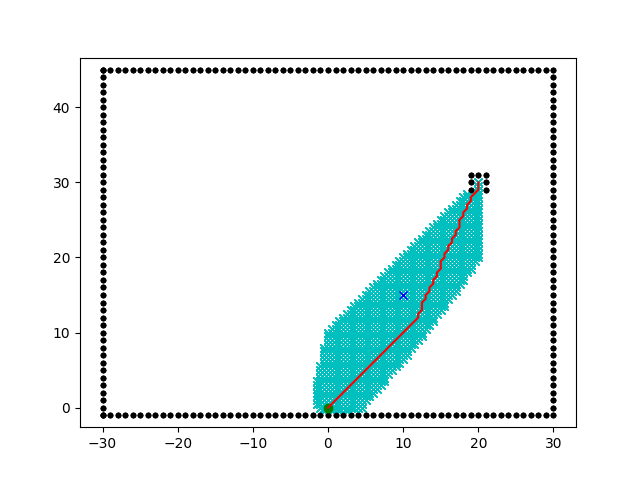

# Path Planning Package (ROS 2)

This ROS 2 package implements the A* path planning algorithm to find an optimal path in a grid map, considering obstacles and different cost factors. It subscribes to path requests and publishes optimized path transitions.

This implementation is based on the A* grid planning code by Atsushi Sakai and Nikos Kanargias.

## Features

*   **A* Algorithm:** Core pathfinding logic using the A* search algorithm.
*   **ROS 2 Integration:** Runs as a ROS 2 node (`PathPlanningNode`).
*   **Dynamic Obstacle Handling:** Generates obstacle maps based on input target type and position. Supports "gate", "non_gate", and "flare" types with different obstacle configurations.
*   **Cost Model:** Incorporates configurable costs related to fuel (`C_F`, `Delta_F`, `Delta_F_A`), time (`C_T`, `Delta_T`, `Delta_T_A`), and fixed costs (`C_C`). Includes areas with potential cost reduction (`Cp`).
*   **Path Optimization:** Optimizes the raw path by combining consecutive movements in the same direction.
*   **Custom Messages:** Uses `custom_interfaces/msg/PathInfo` for input and `custom_interfaces/msg/PathTransition` for output.
*   **Visualization:** Optionally plots the generated path, obstacles, start, and goal points using Matplotlib and saves it to `optimized_path_plot.png`.

## Dependencies

*   ROS 2 (tested on Jazzy, likely compatible with others)
*   Python 3.x
*   `rclpy` (ROS 2 Python client library)
*   `numpy`
*   `matplotlib`
*   `custom_interfaces` package: This package must exist in your workspace and contain the `PathInfo.msg` and `PathTransition.msg` definitions.

## Installation

1.  **Clone the Repository:**
    Clone this repository into the `src` directory of your ROS 2 workspace.
    ```bash
    cd ~/your_ros2_ws/src
    git clone <your-repository-url> # Replace with your repo URL
    ```

2.  **Install Dependencies:**
    Ensure all dependencies listed above are installed. If your `custom_interfaces` package isn't built yet, make sure it's also in the `src` directory. Use `rosdep` if applicable:
    ```bash
    cd ~/your_ros2_ws
    rosdep install --from-paths src --ignore-src -r -y
    ```

3.  **Build the Workspace:**
    ```bash
    cd ~/your_ros2_ws
    colcon build --packages-select path_planning_pkg custom_interfaces # Add other packages if needed
    ```

4.  **Source the Workspace:**
    ```bash
    source ~/your_ros2_ws/install/setup.bash
    # Or setup.zsh depending on your shell
    ```

## Usage

1.  **Run the Node:**
    Launch the path planning node:
    ```bash
    ros2 run path_planning_pkg path_planning_node # Ensure the executable name matches your setup.py
    ```
    The node will initialize and wait for messages on the `/path/info` topic.

2.  **Publish Path Request:**
    Send a path request by publishing a `PathInfo` message. Specify the target `name` (e.g., "gate", "non_gate", "flare") and the `target` coordinates `[x, y]`.

    *Example (Gate):*
    ```bash
    ros2 topic pub /path/info custom_interfaces/msg/PathInfo "{name: 'gate', target: [10.0, 5.0]}" --once
    ```

    *Example (Non-Gate Obstacle):*
    ```bash
    ros2 topic pub /path/info custom_interfaces/msg/PathInfo "{name: 'non_gate', target: [8.0, 3.0]}" --once
    ```

3.  **Receive Path Transitions:**
    The node will process the request, calculate the path, optimize it, and publish the result as a `PathTransition` message on the `/path/transitions` topic. You can listen to this topic:
    ```bash
    ros2 topic echo /path/transitions
    ```
    The output will contain lists of sequential x and y movements (`target_x`, `target_y`).

## Configuration

*   **Cost Parameters:** Modify the cost values (`C_F`, `C_T`, `C_C`, `Delta_F`, `Delta_T`, `Delta_F_A`, `Delta_T_A`, `Cp`) directly within the `AStarPlanner` class `__init__` method in `path_planning.py`.
*   **Grid & Robot Size:** Adjust `grid_size` and `robot_radius` in the `PathPlanningNode` class `__init__` method.
*   **Animation:** Set the `show_animation` global variable to `True` or `False` at the top of `path_planning.py` to enable or disable plotting.

## Custom Messages

This package relies on a separate `custom_interfaces` package containing:

*   **`PathInfo.msg`**:
    ```
    string name      # Name/type of the target (e.g., "gate", "non_gate")
    float64[2] target # Target [x, y] coordinates
    ```
*   **`PathTransition.msg`**:
    ```
    float64[] target_x # List of sequential x movements
    float64[] target_y # List of sequential y movements
    ```
    Ensure this package is present and built in your workspace.

## Visualization

The script will generate a plot showing:

*   Obstacles (black dots)
*   Start position (green circle)
*   Original target position (blue cross)
*   Calculated path (red line)

**Example Output Plot:**



## Credits

*   The core A* grid planning algorithm implementation is from the work by Atsushi Sakai (@Atsushi_twi) and Nikos Kanargias (nkana@tee.gr). See their original work [here](https://github.com/AtsushiSakai/PythonRobotics/).
*   This was developed in collaboration with Leung-Kam-Ho in his robotic project and reuses/adapts code from their original project repository, available at [https://github.com/Leung-Kam-Ho/201_ENG1003_AAE_GP8](https://github.com/Leung-Kam-Ho/201_ENG1003_AAE_GP8).